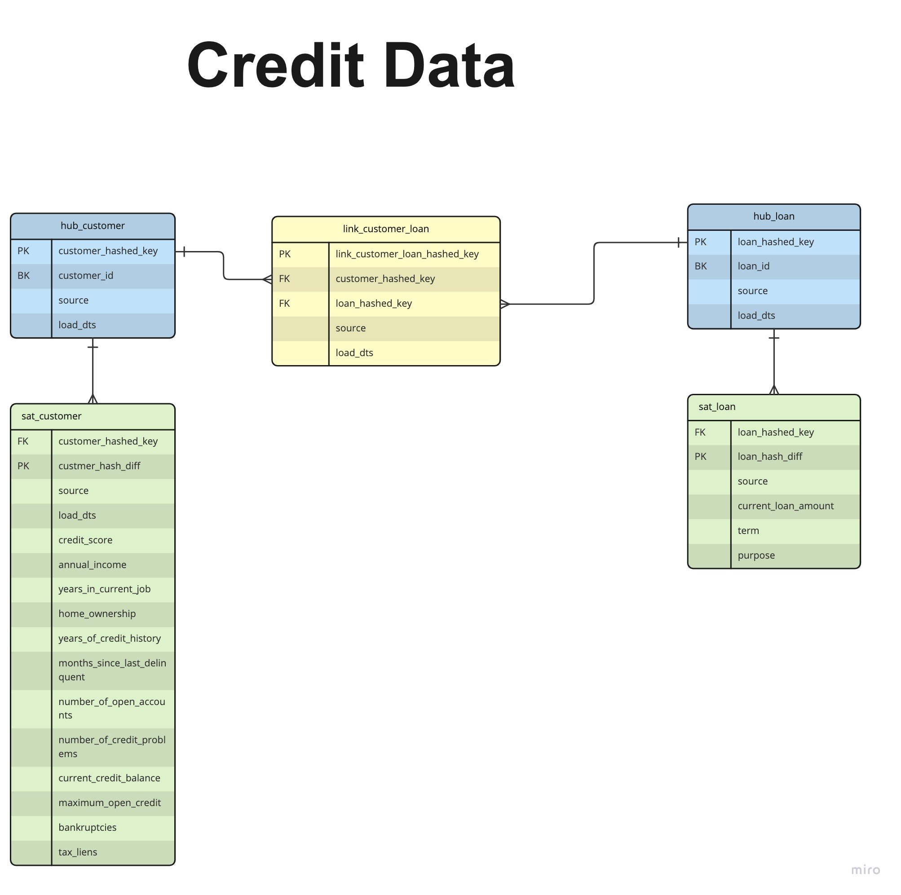

## Test dbt-vault pipeline

### Dataflow
Data flow consists of two parts:
1) **Staging part:**  We use **fal** extension to link a custom python script to a dbt pipeline. ("./fal_scripts/load_csv_data.py")
   The script is configured to run before dbt by adding it to meta property of the model in schema.yml
   Name of the buffer table should be specified in env vars. The model is in raw_Stage
2) **Modelling part:** DBT transfers data form a buffer table into a data vault. 
   We use Datavault-UK/dbtvault package to automatically create required tables and meta columns

### ToDO
1) Code will not work as is because we do not have db connection configured.
2) We need to add tests (can use GreatExpectations package)
3) We need to create a view depending on the objectives of the dataset
4) The raw data needs timestamp. It would be really nice we could obtain timestamped data and not use a load date for versioning

